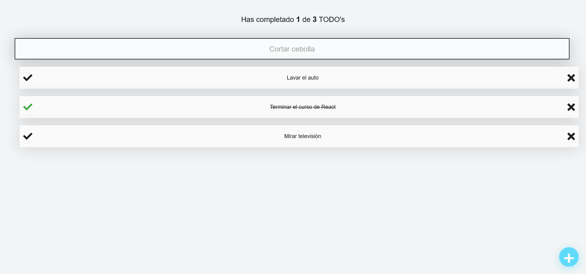

# TodoMachine

Proyecto TodoMachine del Curso de React.js de la plataforma Platzi.
En este curso se trabaja con componentes, props, estilos CSS, estados y efectos de React. 
Se implementa React Context, React Portals y almacenamiento con Local Storage.

## Screenshots

